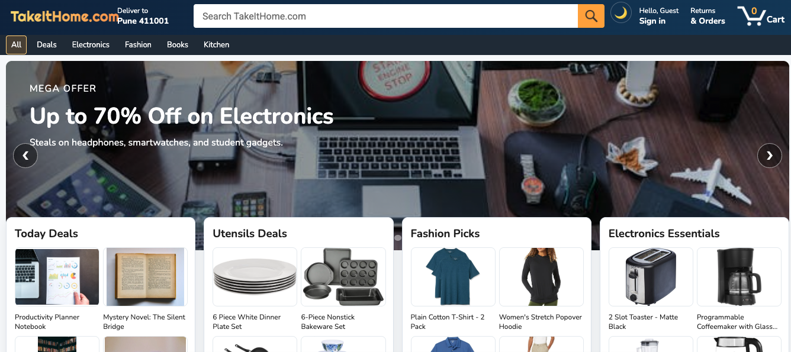
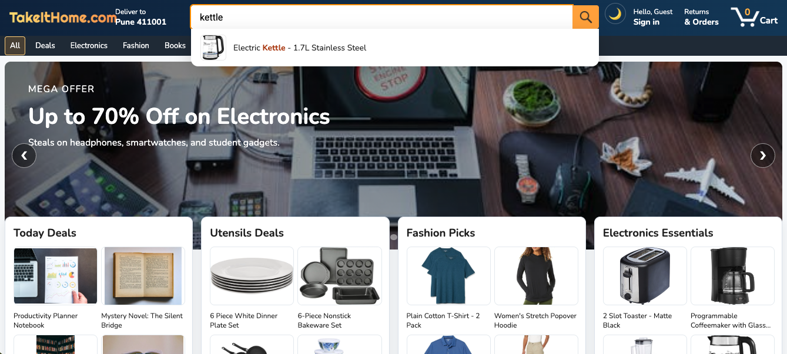
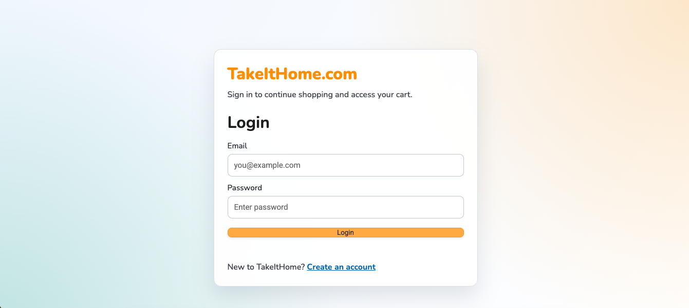
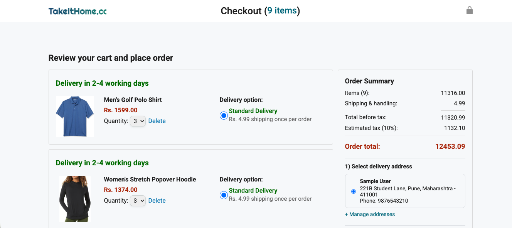
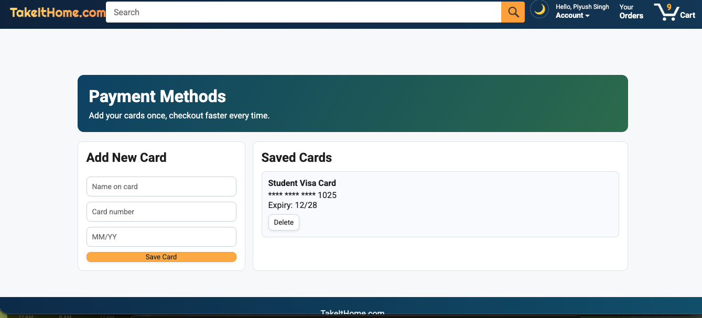

# 🛒 TakeItHome – Browser-Based E-Commerce Storefront

## 🚀 Overview
TakeItHome is a fully functional browser-based e-commerce web application inspired by modern online shopping platforms. It simulates a complete shopping experience including product browsing, search, cart management, authentication, and checkout — all without a backend server.

The application uses a client-side architecture where all data (products, cart, user, orders, and preferences) is managed and persisted using localStorage.

---

## 🔧 Tech Stack
- **Frontend:** HTML, CSS, JavaScript  
- **State Management:** localStorage  
- **Architecture:** Modular JavaScript (separation of concerns)

---

## ✨ Features

### 🛍️ Shopping Experience
- Product browsing with category filtering  
- Live search with sorting (price, rating)  
- Product detail modal view  
- Add to cart with real-time feedback  

### 🧾 Cart & Checkout
- Dynamic cart management (add, remove, update quantity)  
- Checkout flow with order summary  
- Address and payment selection  
- Order confirmation simulation  

### 👤 User System
- Signup / Login functionality  
- Persistent user sessions  
- User-specific cart and data storage  

### 🎨 UI/UX
- Hero carousel and category cards  
- Responsive product grid  
- Toast notifications and animations  
- Dark mode support  
- Back-to-top navigation  

---

## 🧠 Architecture & Design

- **Modular Structure:** Each feature is separated into dedicated JavaScript modules (cart, auth, products, UI, checkout)
- **Client-Side Persistence:** All data (cart, users, addresses, payments) is stored in localStorage
- **Reusable UI Components:** Product cards, modals, and shared layout elements
- **Global State Sync:** Cart and authentication state is shared across all pages

---

## 📂 Project Structure (Key Files)

- `takeitHome.js` – Main homepage logic (search, filtering, UI control)  
- `cart.js` – Cart management and operations  
- `auth.js` – User authentication system  
- `products.js` – Product catalog and search logic  
- `ui.js` – UI rendering and interactions  
- `checkout.js` – Checkout and order processing  
- `site-shell.js` – Shared header, navigation, and global state  

---

## 📦 How It Works

- Products are initialized from a local dataset  
- User interactions update state stored in localStorage  
- Cart, authentication, and checkout flow operate entirely on the client  
- No backend or API calls are required  

---

## 📦 Getting Started

### Run Locally
1. Clone the repository:
   ```bash
   git clone https://github.com/PiyushSingh5002/amazon-repo


Some of the screen shots for demo:
1-HOMEPAGE-
2-PRODUCT_SEARCH:
3-USER LOGIN:
4:-CART:
5:PAYMENT(CARD):

⚠️ Limitations
	•	No backend or database (client-side simulation only)
	•	Payment system is mocked (not real transactions)
	•	Orders and tracking pages are static/demo-based

    (These limitations are not weaknesses of this project. They can be easily improved, and I have solutions for each of them. In fact, these limitations provide more flexibility and customization in every aspect of the project according to your needs. )

🌱 Future Improvements
	•	Backend integration (Node.js / Firebase)
	•	Real payment gateway integration
	•	Database for persistent storage
	•	Improved order tracking system

👨‍💻 Author

Piyush Singh
	•	GitHub: https://github.com/PiyushSingh5002
	•	LinkedIn: https://www.linkedin.com/in/piyush-singh-a91382345/


⭐ Key Highlights
	•	Built a complete e-commerce workflow without backend
	•	Designed modular, scalable frontend architecture
	•	Implemented real-time UI updates and persistent state